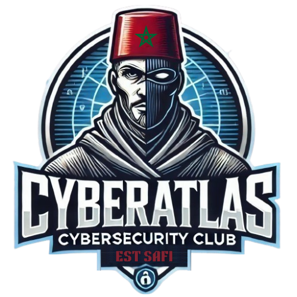
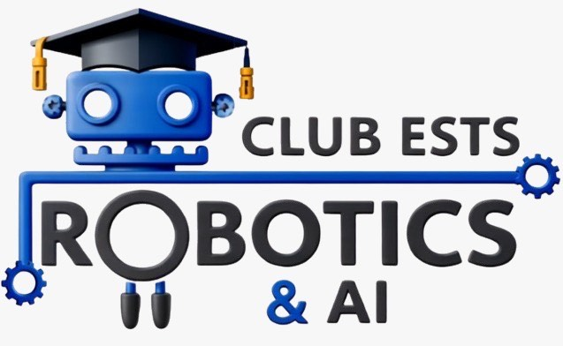

# 🚀 GitQuest: CyberAtlas x RoboticsAI

<div align="center">
  <table>
    <tr>
      <td align="center"></td>
      <td align="center"></td>
    </tr>
    <tr>
      <td align="center" style="font-size: 18px;"><b>CyberAtlas</b></td>
      <td align="center" style="font-size: 18px;"><b>Robotics & AI Club</b></td>
    </tr>
  </table>
</div>

Welcome to **GitQuest**, an exciting collaboration between **CyberAtlas** and **Robotics & AI Club**! 🎉 Our goal is to empower students with essential **Git and GitHub** skills in a fun and interactive way. Whether you're a total beginner or looking to sharpen your skills, this collab will guide you through version control like a pro! 💻✨

## 📌 Why This Collaboration?

Both **CyberAtlas** (focused on cybersecurity) and **Robotics & AI Club** (focused on innovation and AI) believe in open-source learning. Through this initiative, we aim to:
- Teach students **Git & GitHub** step by step.
- Promote collaboration through real-world **pull requests, branches, and commits**.
- Strengthen teamwork between tech enthusiasts from different fields.

---

## 📖 What You’ll Learn

- **Basic Git commands** (clone, add, commit, push, pull, etc.)
- **Branching & Merging** – How to work in teams effectively
- **Handling Merge Conflicts** – Because teamwork gets messy! 😆
- **GitHub Workflow** – Issues, Pull Requests, and Code Reviews
- **Contributing to Open Source** – Your first step into the dev world! 🌍

---

## 🎮 Fun & Unique Activities!

To make this session engaging, we have planned some fun activities:

🔥 **The Merge Conflict Battle** – You’ll be given a conflicting file to resolve in teams. First team to fix it wins!
🚀 **Git Scavenger Hunt** – Follow a series of Git challenges hidden in different branches!
🎭 **Git Commit Storytelling** – Make commits that tell a funny or mysterious story. Creativity is key! 😆
🎖️ **Pull Request Challenge** – Your first PR gets you a surprise reward! 🎁

---

## 🛠️ Setup Guide

Before we start, make sure you have:

1. **Git Installed** – [Download Git](https://git-scm.com/downloads)
2. **A GitHub Account** – [Sign up here](https://github.com/)
3. **A Code Editor** – VS Code, JetBrains, or your favorite!

**Clone this repo and get started:**
```sh
git clone https://github.com/CyberAtlas-RoboticsAI/GitQuest.git
```

---

## 🤝 Meet the Teams

👨‍💻 **CyberAtlas** – A cybersecurity-focused club specializing in ethical hacking, SOC, and CTF challenges.
🤖 **Robotics & AI Club** – Innovators in AI, machine learning, and robotics solutions.

Together, we make an unstoppable tech force! 💪🔥

Let's embark on this **GitQuest** and level up our coding collaboration skills! 🚀💡

